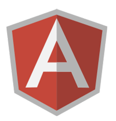

# generator-nglib [](https://travis-ci.org/cork-labs/generator-nglib)

> [Yeoman](http://yeoman.io) generator. Generates a project to develop Angular libraries, based on [boilerplate-nglib](https://github.com/cork-labs/boilerplate-nglib).

 

## Getting Started

Install dependencies:

```bash
npm install -g yo generator-nglib
```

Run the generator in an empty dir.

```bash
mkdir my.lib
cd my.lib
yo nglib
```

The default settings will be generated from the the directory name. You will be prompted to costumise them.

```
? Customize? (Y/n)
```

Once you are happy with the settings, just answer `Y` and the project will be generated for you.

Now you can start development of your library. Please refer to [boilerplate-nglib](https://github.com/cork-labs/boilerplate-nglib)
for the complete documentation.


## Options

### --config <URL|FILE>

Run the generator pre-seeding the `.yo-rc.json` file with your own default settings.

You can use a local file.

```bash
yo nglib --config ~/yo-nglib.json
```

Or any URL:

```bash
yo nglib --config https://raw.githubusercontent.com/account/repo/master/my-yo-rc.seed.json
```

### --tpl <GIT|PATH>

Override default skeleton and templates with your own files. This will generate your library from the default
skeleton + the contents fetched from `--tpl`, allowing you to override any of the default templates and/or add extra
files.

You can use a local path.

```bash
yo nglib --tpl ~/nglib-skeleton
```

Or a Github URL:

```bash
yo nglib --tpl git@github.com:account/repo.git
```

### --tpl-path <PATH>

If you provided a Github URL for `--tpl`, you can source the skeleton/templates from within this path, relative to the
repo root.

```bash
yo nglib --tpl git@github.com:account/repo.git --tpl-path skeletons/nglib
```

### --tpl-branch <BRANCH>

If you provided a Github URL for `--tpl`, you can source the skeleton/templates from this branch/tag.

```bash
yo nglib --tpl git@github.com:account/repo.git --tpl-branch v1.0.1
```

### --skip-interactive

If this flag is provided, the generator will not prompt you to costumise the settings. This is useful to automate the
whole process, providing a `--config` seed to the generator.


## [MIT License](LICENSE-MIT)

[Copyright (c) 2015 Cork Labs](http://cork-labs.mit-license.org/2015)

Permission is hereby granted, free of charge, to any person obtaining a copy of
this software and associated documentation files (the "Software"), to deal in
the Software without restriction, including without limitation the rights to
use, copy, modify, merge, publish, distribute, sublicense, and/or sell copies of
the Software, and to permit persons to whom the Software is furnished to do so,
subject to the following conditions:

The above copyright notice and this permission notice shall be included in all
copies or substantial portions of the Software.

THE SOFTWARE IS PROVIDED "AS IS", WITHOUT WARRANTY OF ANY KIND, EXPRESS OR
IMPLIED, INCLUDING BUT NOT LIMITED TO THE WARRANTIES OF MERCHANTABILITY, FITNESS
FOR A PARTICULAR PURPOSE AND NONINFRINGEMENT. IN NO EVENT SHALL THE AUTHORS OR
COPYRIGHT HOLDERS BE LIABLE FOR ANY CLAIM, DAMAGES OR OTHER LIABILITY, WHETHER
IN AN ACTION OF CONTRACT, TORT OR OTHERWISE, ARISING FROM, OUT OF OR IN
CONNECTION WITH THE SOFTWARE OR THE USE OR OTHER DEALINGS IN THE SOFTWARE.
